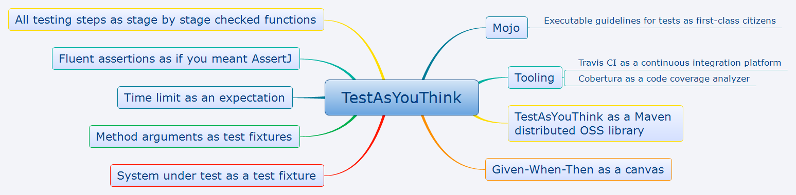

What you think is what you test... Not yet another testing API or framework!



Matter | Badges
------ | ------
Software factory    | [](https://trello.com/b/EVoCzyHq) [](http://search.maven.org/#search%7Cga%7C1%7Ctest-as-you-think) master: { [](https://travis-ci.org/xapn/test-as-you-think), [](https://codecov.io/gh/xapn/test-as-you-think) } develop: { [](https://travis-ci.org/xapn/test-as-you-think), [](https://codecov.io/gh/xapn/test-as-you-think/branch/develop) } [](http://javadoc.io/doc/com.github.xapn/test-as-you-think-core)
Source code         | [](https://github.com/xapn/test-as-you-think) [](https://github.com/xapn/test-as-you-think) [](https://github.com/xapn/test-as-you-think) [](https://github.com/xapn/test-as-you-think) [](https://github.com/xapn/test-as-you-think)
Licensing           | [](http://www.gnu.org/licenses/lgpl-3.0) [](https://github.com/xapn/test-as-you-think/graphs/contributors)
Social coding       | [](https://twitter.com/intent/tweet?text=Wow:&url=https%3A%2F%2Fgoo.gl%2FXqS4Zf) [](https://twitter.com/intent/follow?screen_name=xengineer) [](https://github.com/xapn/test-as-you-think/stargazers) [](https://github.com/xapn/test-as-you-think/watchers) [](https://github.com/xapn/test-as-you-think/network)

Please use this [permalink](https://goo.gl/XqS4Zf) (goo.gl/XqS4Zf) to share this web page and to get [analytics data](https://goo.gl/#analytics/goo.gl/XqS4Zf/all_time). You can also use this [QR code](https://chart.googleapis.com/chart?cht=qr&chs=150x150&choe=UTF-8&chld=H&chl=https://goo.gl/XqS4Zf).


Let you know your tests are exemplary with this badge: [](http://testasyouthink.org)

<!-- toc -->

- [Fluent testing and added value](#fluent-testing-and-added-value)
- [Getting Started](#getting-started)
  * [Installation](#installation)
  * [Basics](#basics)
  * [Test Fixtures](#test-fixtures)
    + [Separation of concerns with multiple Given steps](#separation-of-concerns-with-multiple-given-steps)
    + [Specifying test fixtures](#specifying-test-fixtures)
    + [System under test as a test fixture](#system-under-test-as-a-test-fixture)
    + [Method arguments as a test fixture](#method-arguments-as-a-test-fixture)
  * [Event](#event)
    + [Starting with the event](#starting-with-the-event)
    + [Avoid ambiguous method calls](#avoid-ambiguous-method-calls)
  * [Expectations](#expectations)
    + [Separation of concerns with multiple Then steps](#separation-of-concerns-with-multiple-then-steps)
    + [Specifying expectations](#specifying-expectations)
    + [Expectations as predicates](#expectations-as-predicates)
    + [Failures](#failures)
      - [Expected failures](#expected-failures)
      - [Unexpected failures](#unexpected-failures)
      - [No failure](#no-failure)
    + [Time limit](#time-limit)
    + [Fluent assertions as a chained extension](#fluent-assertions-as-a-chained-extension)
    + [Standard streams, standard output & standard error as a result](#standard-streams-standard-output--standard-error-as-a-result)
- [Functional approach of testing](#functional-approach-of-testing)
- [Code Examples](#code-examples)
- [Releases](#releases)
  * [Versioning](#versioning)
  * [Release Notes](#release-notes)
    + [0.8 version: Standard streams as a result](#08-version-standard-streams-as-a-result)
    + [0.7 version: All testing steps as stage by stage checked functions](#07-version-all-testing-steps-as-stage-by-stage-checked-functions)
    + [0.6 version: Fluent assertions as if you meant AssertJ](#06-version-fluent-assertions-as-if-you-meant-assertj)
    + [0.5 version: System under test as a test fixture](#05-version-system-under-test-as-a-test-fixture)
    + [0.4.2 version: Cobertura as a code coverage analyzer](#042-version-cobertura-as-a-code-coverage-analyzer)
    + [0.4.1 version: Travis CI as a continuous integration platform](#041-version-travis-ci-as-a-continuous-integration-platform)
    + [0.4 version: Time limit as an expectation](#04-version-time-limit-as-an-expectation)
    + [0.3 version: TestAsYouThink as a Maven distributed OSS library](#03-version-testasyouthink-as-a-maven-distributed-oss-library)
    + [0.2 version: Method arguments as test fixtures](#02-version-method-arguments-as-test-fixtures)
    + [0.1 version: Given-When-Then as a canvas](#01-version-given-when-then-as-a-canvas)
- [License](#license)

<!-- tocstop -->

# Fluent testing and added value

*TestAsYouThink* is an open source software library in Java for testing purposes. It is designed as a **fluent API** that will change the way development teams write their unit and integration tests. It aims to take control over the coding practices as **executable guidelines**, from beginners to experts, to get **high-quality tests**. Why should you adopt *TestAsYouThink*?
- It promotes good coding practices for testing, on writing tests rather than before it with training or after it with code reviews.
- It makes the testing language [ubiquitous](https://martinfowler.com/bliki/UbiquitousLanguage.html) to give a better structure based on compilable code rather than textual comments to the test code.
- It improves test code readability and may bring more conciseness.
- It brings a [functional programming](https://en.wikipedia.org/wiki/Functional_programming) approach to testing that makes reusing test code easier and more natural.
- It is designed to be easy to use thanks to code completion.
- It builds new original features to test execution from version to version.


Why to name this API *TestAsYouThink*? The goal of *TestAsYouThink* is to map out the road from a new software functionality idea to its contractualized achievement as an executable test, while preserving product developers against known pitfalls. According to this perspective, any pitfall is likely to extend the developer's journey and to put him off his target. By anticipating such pitfalls, *TestAsYouThink* will be the best way to reduce the distance to proper, durable testing.

Moreover *TestAsYouThink* uses the [Given-When-Then](https://www.agilealliance.org/glossary/gwt/) canvas as a formal guide to compose tests. This canvas originally comes from [Gherkin](https://sites.google.com/site/unclebobconsultingllc/the-truth-about-bdd) that is a grammatical protocol used in the [Behavior-Driven Development](https://en.wikipedia.org/wiki/Behavior-driven_development) method to write test scenarii in a business human-readable way by specifying a software behavior basing on concrete examples. [Given-When-Then](https://www.agilealliance.org/glossary/gwt/) serves to divide any test into the three eponym steps. This canvas is implemented by the *TestAsYouThink* project to deliver a [DSL](https://en.wikipedia.org/wiki/Domain-specific_language) style [fluent API](https://en.wikipedia.org/wiki/Fluent_interface).

# Getting Started

## Installation

Add *TestAsYouThink* as a dependency to your project with [Maven](https://maven.apache.org), or download it from [Maven Central](https://search.maven.org/#search%7Cga%7C1%7Ctest%20as%20you%20think).
```xml
<dependency>
    <groupId>com.github.xapn</groupId>
    <artifactId>test-as-you-think-core</artifactId>
    <version>0.8-m1</version>
</dependency>
```

## Basics

Here is the minimal syntax to implement your test methods as a *Given-When-Then* scenario.
```java
givenSut(() -> {})
.when(sut -> {})
.then(() -> {});
```

Let us complete the previous scenario with a very simple example of what you can do, while testing a non-void method of your system under test (abbreviated as SUT later), the `SystemUnderTest` class here.
```java
import static testasyouthink.TestAsYouThink.givenSutClass;
...

givenSutClass(SystemUnderTest.class)
.given(sut -> {
    // Where you prepare the context that defines the initial state of the SUT.
    DataSet dataSet = new DataSet(...);
    sut.setAnyAttribute(...);
}).when(sut -> {
    // Where you make an event happen in relation to an action of a customer.
    return sut.nonVoidMethod(...);
}).then(result -> {
    // Where you verify the expectations are reached, by using your favorite assertion API.
    assertThat(result).isEqualTo(...);
});
```

Notice that:
- the `TestAsYouThink` class is the only one end point of the API;
- any *Given-When-Then* step can be implemented by a lambda or a method reference, so that the granularity of reuse is function, not class;
- you manipule the same SUT type from the beginning to the end, because the `sut` type is determined during the *Given* step, until the end;
- there is no need to instantiate the `sut` object, even if it is allowed by the `givenSut(sutInstance)` alternate end point method, as below;
- the call to any `given()` method is optional;
- you manipule the same `result` type until the end, because the `result` type is determined during the *When* step;
- you cannot inadvertently make a fake test that would verify nothing, because any `then()` method is always a sequence termination.

Of course, it is also possible to test any void method, instead of a non-void one, like this. 
```java
import static testasyouthink.TestAsYouThink.givenSut;
...

givenSut(SystemUnderTest::new)
.given(() -> {
    // Preparation of fixtures
}).when(sut -> {
    // Event or action
    sut.voidMethod(...);
}).then(() -> {
    // Verification of expectations
});
```

## Test Fixtures

A [test fixture](https://en.wikipedia.org/wiki/Test_fixture) is a predictable state of a set of objects or values to prepare a running test at the beginning of its lifecycle. The goal of any test fixture is to make tests repeatable. What follows can be part of a text fixture:
- the system under test (SUT),
- its collaborators or the test doubles of its collaborators (like stubs or mocks),
- its other dependencies,
- any input data, like an argument passed to the tested method of the SUT.

Through misuse of language, an object such as the previous ones is often called a test fixture.

Rather than mixing all fixtures in one monolith of code, *TestAsYouThink* applies the separation of concerns to fixtures with multiple *Given* steps.

### Separation of concerns with multiple Given steps

If your fixtures preparation may be divided into several blocks, you can make them materialize.
```java
givenSutClass(SystemUnderTest.class)
.given(() -> {
    // the first Given step
})
.and(() -> {
    // another Given step to prepare some extra test fixtures
}) // to be repeated as many times as you need
.when(sut -> {}).then(() -> {});
```

### Specifying test fixtures

You are encouraged to explain your intentions to share and remember them by specifying your test fixtures. What makes them specific to the current test case?
```java
givenSutClass(SystemUnderTest.class)
.given("a special fixture", () -> {
    // Where to prepare it.
})
.and("another special fixture", () -> {
    // Where to prepare it.
}) // to be repeated as many times as you need
.when(sut -> {}).then(result -> {});
```

### System under test as a test fixture

You can prepare the SUT in a separate *Given* step.
```java
givenSutClass(SystemUnderTest.class)
.given(sut -> {
    // SUT preparation in a Given step
})
.when(sut -> {}).then(() -> {});
```

The same preparation is allowed with a more compact syntax.
```java
givenSut(SystemUnderTest.class, sut -> {
    // SUT preparation at first
})
.when(sut -> {}).then(() -> {});
```

The following other one lets you prepare the SUT even as facing some instantiation constraints.
```java
givenSut(() -> {
    // SUT preparation at first
    return systemUnderTest;
})
.when(sut -> {}).then(() -> {});
```

### Method arguments as a test fixture

If some fixtures are the arguments of the method to be tested, you may favor the following alternate syntaxes.
```java
givenSutClass(SystemUnderTest.class)
.givenArgument("simple argument", anyValue)
.andArgument("argument to be built", () -> {
    // Where this argument is built.
})
.andArgument("argument already ready to be used", DataProvider::choosenDataSet)
.when(SystemUnderTest::nonVoidMethodWithArguments).then(result -> {});
```
The arguments prepared as test fixtures will be injected as argument values when the method to be tested is called. As you can guess, `Data::choosenDataSet` is a method reference.

Moreover, only __three arguments per method at most__ are accepted: it is considered as a maximum to get a good design. Above, you should refactor the SUT code.

Instantiate each argument might be a little tedious: let the API do that for you if the argument type is mutable.
```java
givenSutClass(SystemUnderTest.class)
.givenArgument(Argument.class, whatIsSpecial -> {
    // Where the argument is prepared.
    whatIsSpecial.setWhatYouNeed(specialValue);
})
.when(SystemUnderTest::targetMethodWithArgument).then(result -> {});
```
Notice that the `whatIsSpecial` name must specify the argument and it replaces the previous literal description.

## Event

You can use different syntaxes to pass the event to the `when()` method:
- a method reference (`SystemUnderTest::targetMethod` or `systemUnderTest::targetMethod` where `systemUnderTest` is an instance),
- a lambda statement (`sut -> { return sut.targetMethod(); }`),
- a lambda expression (`sut -> sut.targetMethod()`).

All of them are useful: the more proper one depends on the use case.

You can favor the simplest `when()` method, or choose a more explicit, alternate method: `whenSutReturns()` if a result is expected; otherwise `whenSutRuns()`.

### Starting with the event

To write very simple tests, you might want to directly attack the system under test. In such a use case, the API syntax becomes very minimalist.
```java
import static testasyouthink.TestAsYouThink.when;
import static testasyouthink.TestAsYouThink.resultOf;
...

when(() -> systemUnderTest.targetMethod(oneOrMoreArguments)).then(...); // or...
when(systemUnderTest::targetMethod).then(...); // without arguments to be passed to the target method

resultOf(SystemUnderTest::targetMethod).satisfies(requirements); // to chain fluent assertions as explained below
```

### Avoid ambiguous method calls

To define the event, you may want to pass a lambda expression to the `when()` method like this.
```java
givenSutClass(SystemUnderTest.class)
.when(sut -> sut.testedMethod()) // compilation error
.then(...);
```
In such a case, the compiler meets an error because of an ambiguous method call: it does not know which `when()` method must be called. One receives a lambda that returns a value, while another one receives a lambda that returns nothing. Instead of casting the lambda expression to a function or a consumer or replacing it with a lambda statement, you can solve this compilation problem by using the following alternate methods.

Without return:
```java
givenSutClass(SystemUnderTest.class)
.whenSutRuns(sut -> sut.voidMethod(...))
.then(...);
```
With a return:
```java
givenSutClass(SystemUnderTest.class)
.whenSutReturns(sut -> sut.nonVoidMethod(...))
.then(...);
```

## Expectations

### Separation of concerns with multiple Then steps

You can separate expectation concerns if needed. The following example separates expectations between the result and the SUT.
```java
givenSutClass(SystemUnderTest.class).when(sut -> { return sut.nonVoidMethod(); })
.then(result -> {
    // Where the result meets expectations.
}, sut -> {
    // Where the SUT meets expectations.
});
```

You can also separate the result expectations in detached blocks.
```java
givenSutClass(SystemUnderTest.class).when(sut -> { return sut.nonVoidMethod(); })
.then(result -> {
    // an expectation
}).and(result -> {
    // another expectation
});
```

### Specifying expectations

You are encouraged to explain the system under test behavior by specifying your expectations. What is the expected behavior in the current situation?
```java
givenSutClass(SystemUnderTest.class).when(sut -> { ... })
.then("first specified expectation", result -> {
    // Expectation as specified
}).and("second specified expectation", result -> {
    // Another expectation as specified
});
```

### Expectations as predicates

You can write your expectations by providing one or more predicates instead of assertions.
```java
givenSutClass(SystemUnderTest.class).when(sut -> { return sut.nonVoidMethod(); })
.then(result -> { // a predicate related to the result
    return booleanExpressionAboutResult();
}, sut -> { // a predicate related to the SUT
    return booleanExpressionAboutSut();
});
```

### Failures

If a method signature contains a `throws` clause with a checked, compile-time exception, it is not necessary to modify the testing method signature anymore by adding the same clause to it. This clause and its spreading are considered as a technical constaint without value in a executable specification approach. As a consequence, it becomes imperceptible for the test code, and above all for the software developer who can stay focused on his tests. Tests will continue to fail if any unexpected exception is raised.

#### Expected failures

Because the failure testing is an important part of your use cases, you can verify the behavior of the system under test when it is used ouside operating conditions.
```java
givenSutClass(SystemUnderTest.class)
.whenSutRunsOutsideOperatingConditions(sut -> {
    // where an event causes a failure
})
.thenItFails()
.becauseOf(ExpectedFailure.class)
.withMessage("expected message");
```

Without an explicit SUT, you get:
```java
import static testasyouthink.TestAsYouThink.whenOutsideOperatingConditions;
...

whenOutsideOperatingConditions(() -> {
    // where an event causes a failure
})
.thenItFails();
```

You can also verify the cause like follows: `thenItFails().havingCause(ExpectedCause.class).withCauseMessage("expected cause message")`.

#### Unexpected failures

When an unexpected failure occurs - because of a regression for example -, the test fails by raising an `Error`, because the defaut behavior consists of assuming no failure should happen, unless the software developer wants. Each `Error` type belongs to one testing stage as indicated in the table below.

Testing stage | Error type          | Meaning
------------- | ------------------- | -------
Preparation   | `PreparationError`  | A failure happened while trying to prepare the test fixture. The test is not ready for execution.
Execution     | `ExecutionError`    | The target method failed to execute. Either the system under test is not ready for execution and some source code is missing, or the preparation is uncomplete.
Verification  | `VerificationError` | A failure prevented the verification stage from achieving the whole set of assertions.
Verification  | `AssertionError`    | The behavior during the execution was not compliant with the expectations. Either it is a regression and the SUT must be fixed, or the test needs to be updated after a behavioral change of the SUT.

When a test fails, the origin of the raised error becomes the error cause and the stack trace should explain what exactly happened: the first failure points out the testing stage so that you know what kind of solution is needed, and the second one is the real failure cause.

#### No failure

Sometimes the only thing to verify when executing the target method is that no failure happens. This kind of assertion is useful for the methods whose the only purpose is to check a requirement and to raise an exception if it is not satisfied.
```java
givenSut(SystemUnderClass::new).when(SystemUnderTest::targetMethod)
.thenItSucceeds();
```

### Time limit

Sometimes you need to limit the allowed execution time of the tested event.
```java
givenSutClass(SystemUnderTest.class)
.when(SystemUnderTest::spendSomeTime)
.thenSutRepliesWithin(100);
```
By default, the time limit is given in milliseconds. If you want to use another time unit, simply use the `java.time.Duration` class:
```java
import java.time.Duration;
...

givenSutClass(SystemUnderTest.class)
.when(SystemUnderTest::spendSomeTime)
.thenSutRepliesWithin(Duration.ofMinutes(3);
```

The advantage of *TestAsYouThink* is that the time limit is only applied to the tested event, while [JUnit](https://github.com/junit-team/junit4/wiki/timeout-for-tests) applies its `timeout` to the whole test method with its `@Test` annotation. [JUnit 5](http://junit.org/junit5/docs/snapshot/user-guide/) will propose an `assertTimeout(duration, lambda)` method that returns the lamba result, but such a syntax amalgamates irremediably the expectations and the event.

### Fluent assertions as a chained extension

You never write your assertions without adding [AssertJ](http://joel-costigliola.github.io/assertj) to your projects, don't you? If you have written your test on starting by the event, like this for example...
```java
import static org.assertj.core.api.Assertions.assertThat;
...

when(SystemUnderTest::targetMethod)
.then(fellowshipOfTheRing ->
    assertThat(fellowshipOfTheRing)
        .hasSize(9)
        .contains(frodo, sam)
        .doesNotContain(sauron)
);
```
...maybe you would like to use AssertJ as if it was an extension of *TestAsYouThink*. It is the reason why you can do. It is really useful if the SUT is implicit, when the target method is static for example, and if the assertion scope is narrow. In this case, do not stage your test and write it just as following.
```java
import static testasyouthink.TestAsYouThink.resultOf;
...

resultOf(SystemUnderTest::buildFellowshipOfTheRing)
    .hasSize(9)
    .contains(frodo, sam)
    .doesNotContain(sauron);
```

This usage is foreseen for very simple tests only. On the contrary, if a test scenario consists of the *Given-When-Then* steps, you should structure the whole test by pointing out each step and wrap the assertions in at least one well identified *Then* step, and maybe different ones according to their matters.

Why use `resultOf()` rather than `assertThat()`? Here the goal is to identify the actual result against the expected result at a glance. According to the assertion API, whether it be [JUnit](http://junit.org/junit5/docs/current/api/org/junit/jupiter/api/Assertions.html) or be [AssertJ](http://joel-costigliola.github.io/assertj/core-8/api/org/assertj/core/api/Assertions.html) or be anything else, the order between the actual and expected results is never the same.
```java
/* Java only */
assert expectedOrActual.equals(actualOrExpected); // expected or actual at first with the Java assert keyword

/* JUnit */
org.junit.Assert.assertEquals(expected, actual); // expected at first with JUnit 4
org.junit.jupiter.api.Assertions.assertEquals(expected, actual); // expected at first with JUnit 5
org.testng.AssertJUnit.assertEquals(expected, actual); // expected at first with TestNG

/* Hamcrest */
org.hamcrest.MatcherAssert.assertThat(actual, org.hamcrest.Matchers.is(expected)); // actual at first with Hamcrest

/* AssertJ */
org.assertj.core.api.Assertions.assertThat(actual).isEqualTo(expected); // actual at first with AssertJ
```
As a consequence, if both are inverted, the error message will be wrong and will mislead developers before fixing a failing test. The *TestAsYouThink* `resultOf()` leaves no doubt about which is what by making the testing language [ubiquitous](https://martinfowler.com/bliki/UbiquitousLanguage.html).

### Standard streams, standard output & standard error as a result

These features are specially thought to be used in coding dojos by Software Craftsmen. Indeed most of coding dojos simplify the user interface rendering by printing outputs in the console, mainly thanks to `System.out`, and eventually to `System.err`. Thus *TestAsYouThink* can capture the standard streams for you during the test execution.

Now feel free to make your assertions on the standard output streams easily.
```java
givenSutClass(SystemUnderTest.class)
.when(sut -> {
    // inside a target method that prints some text in stdout
    System.out.println("Output in stdout");
})
.thenStandardOutput(stdout -> assertThat(stdout).contains("Output in stdout"));
```

# Functional approach of testing

The [functional programming](https://en.wikipedia.org/wiki/Functional_programming) approach of *TestAsYouThink* applied to testing is a very important advantage for software developers. As the API is designed to receive the test steps as functions, it makes you free to factorize many little pieces of code and to assembly them again as new test scenarii. Whereas the granularity of reuse of most of testing frameworks is based on classes, you will take advantage of the ability of *TestAsYouThink* to play with more and more bricks of code to expand the covered business cases.

You are even able to begin to code a new component behavior directly in a lambda statement as a *When* step inside a test method. If you are already a [Test-Driven Development](https://en.wikipedia.org/wiki/Test-driven_development) aficionado, be aware it might be a second stage on the [TDD](https://en.wikipedia.org/wiki/Test-driven_development) road to improve and expand your practices. Make the test pass by writing the least implementation code you can in the test method comes from [TDD as if you meant it](https://cumulative-hypotheses.org/2011/08/30/tdd-as-if-you-meant-it).
> *TestAsYouThink* is the first and only testing API that naturally supports the "TDD as if you meant it" practice.

# Code Examples

You can find concrete examples of use in the following repositories.
- [TestAsYouThink examples](https://github.com/xapn/test-as-you-think-examples), with didactic, funny examples of use: do not hesitate to add your own examples being creative.
- [Fizz-Buzz](https://xapn.github.io/fizz-buzz), a coding dojo with many JUnit tests.

# Releases

## Versioning

To understand how version numbers change, please read the [Semantic Versioning](http://semver.org/).

## Release Notes

### 0.8 version: Standard streams as a result

- Capture the standard streams all together (stdout and stderr) to make assertions.
- Migrate all JUnit tests to the version 5 and build test case trees.
- Automatically analyze dependencies to fail builds if needed.
- Open the TestAsYouThink [backlog](https://trello.com/b/EVoCzyHq) by creating a [Trello](https://trello.com) public board.

### 0.7 version: All testing steps as stage by stage checked functions

- Improve the execution stage within a time limit and its corresponding assertions.
  - Prepare the SUT separately, and other usual test fixtures.
  - Prepare the arguments of the target method separately.
- Check the not yet checked testing steps.
  - Check the preparation steps of the system under test.
  - Check the preparation steps of the arguments of the target method.
  - Check the execution steps.
  - Check the verification steps.
- Verify no failure happens.
- Verify both the result and SUT expectations.

### 0.6 version: Fluent assertions as if you meant AssertJ

- Use the [AssertJ](http://joel-costigliola.github.io/assertj) assertions like an extension of the *TestAsYouThink* API with its `resultOf()` end point.

### 0.5 version: System under test as a test fixture

- Prepare the system under test as any other test fixture.
- Prepare the arguments from their types.
- Improve errors: each testing stage has its own type of error, and the real failure becomes the cause of the error.
- Verify the cause of a failure with its message.
- Verify failures without having preparation previously.

### 0.4.2 version: Cobertura as a code coverage analyzer

- Generate the documentation TOC updating with [markdown-toc](https://github.com/jonschlinkert/markdown-toc) and commit the documentation change while building with Maven.
- Check code coverage with [Cobertura](http://cobertura.github.io/cobertura/) and publish reports to [Codecov](https://codecov.io/) while building with [Travis CI](https://travis-ci.org).

### 0.4.1 version: Travis CI as a continuous integration platform

- Build the project with [Travis CI](https://travis-ci.org).

### 0.4 version: Time limit as an expectation

- Expect that the system under test replies within a time limit.
- Resolve ambiguous method calls in relation to using lambda expressions.
- Start to write a test with the when step.

### 0.3 version: TestAsYouThink as a Maven distributed OSS library

- Rename the API to *TestAsYouThink*.
- Choose an open source license.
- Publish artifacts to Maven Central.
- Check version updates.

### 0.2 version: Method arguments as test fixtures

- Include a data as a method argument during the preparation phase.
- Include two data as method arguments during the preparation phase.
- Include three data as method arguments during the preparation phase.
- Receive method arguments directly as values.
- Specify method arguments.
- Verify failures while invoking methods with arguments.
- Verify the expected exception and the expected message separately.

### 0.1 version: Given-When-Then as a canvas

- Write an unit or integration test by using the Given-When-Then canvas and full sequence.
- Delegate the system under test instantiation to the API.
- Reduce the syntactic sequence to a When-Then partial sequence (except the determining of the system under test).
- Specify fixtures in the Given step.
- Specify expectations in the Then step.
- Verify the expectations on the system under test, in addition to the result.
- Provide expectations as predicates.
- Verify failures.
- Separate preparations.
- Separate expectations.

# License

*TestAsYouThink* is distributed under the GNU LGPLv3 license. The LGPLv3 license is included in the LICENSE.txt file. More information about this license is available at [GNU.org](http://www.gnu.org).
